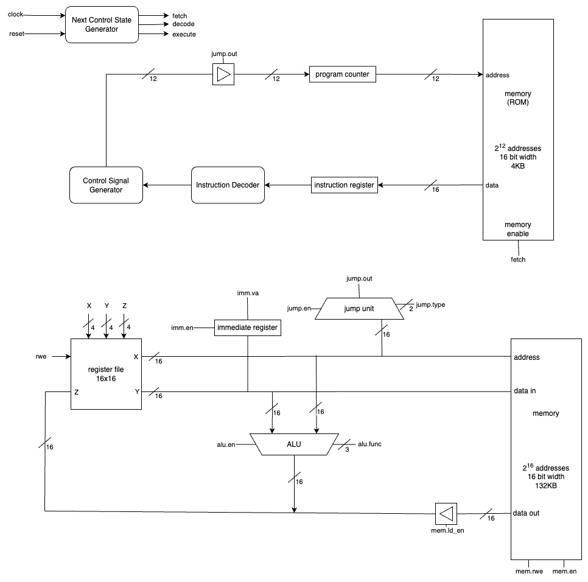
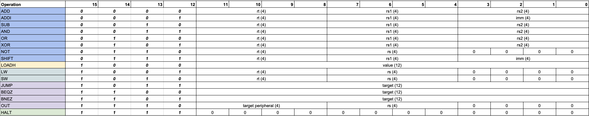

# 16 Bit CPU

In this project, I created a 16-bit architecture and implmented it into a custom hardware/software solution. There are 2 different parts to this project, the hardware and software. The hardware consists of a Vivado project that implments the hardware onto a [Diligent Spartan-7 FPGA](https://digilent.com/reference/programmable-logic/arty-s7/reference-manual).

## The Architecture

For this project, I created a custom architecture that resembles the RISCV architecture.

### Datapath

### Instruction Visualization

## Explanation Videos I Made

As I worked on this project, I enjoyed the idea of being able to record my thought process and progress in videos. I am doing this for myself, but I have made these videos publics on YouTube. You can find them [here](https://www.youtube.com/@amoghkashyap402). 